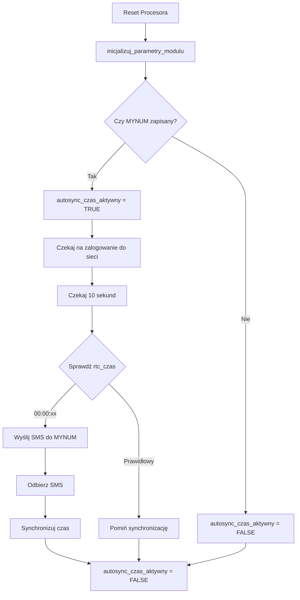

# Dokumentacja Techniczna: Auto-Sync Czasu

## Przegląd

Funkcja auto-sync automatycznie synchronizuje czas w sterowniku AC800-DTM-HS po restarcie procesora, gdy RTC modemu GSM zawiera nieprawidłowy czas (00:00:xx).

## Architektura

### Komponenty

1. **EEPROM Storage** - Przechowywanie własnego numeru telefonu
2. **Auto-Sync State Machine** - Zarządzanie stanem synchronizacji
3. **RTC Time Check** - Sprawdzanie czasu z modemu SIM900
4. **SMS Self-Send** - Wysyłanie SMS do siebie
5. **Time Extraction** - Ekstrakcja czasu z otrzymanego SMS

### Przepływ Danych



## Implementacja

### 1. Zmienne Globalne

```c
// main.c (linia 119-120)
uchar autosync_czas_aktywny = FALSE;  // TRUE gdy oczekujemy na SMS
uchar moj_numer_telefonu[MAX_LICZBA_ZNAKOW_TELEFON + 1];  // Numer własny
```

### 2. Adresy EEPROM

```c
// adresyeeprom.h
#define ADRES_EEPROM_MOJE_NUMER_START 4040  // 10 bajtów (9 cyfr + null)
```

### 3. Inicjalizacja (main.c)

```c
// inicjalizuj_parametry_modulu() - linie 1880-1891
void inicjalizuj_parametry_modulu(void) {
  // ... inne inicjalizacje ...
  
  // Odczytaj numer własny z EEPROM
  eeprom_read_block(moj_numer_telefonu,
                    (const void *)ADRES_EEPROM_MOJE_NUMER_START,
                    MAX_LICZBA_ZNAKOW_TELEFON + 1);
  moj_numer_telefonu[MAX_LICZBA_ZNAKOW_TELEFON] = 0;

  // Włącz auto-sync jeśli mamy zapisany numer
  if (moj_numer_telefonu[0] != 0xFF && moj_numer_telefonu[0] != 0) {
    autosync_czas_aktywny = TRUE;
  }
}
```

### 4. Logika Auto-Sync (main.c)

```c
// steruj_urzadzeniem_100MS() - linie 1530-1557
static void steruj_urzadzeniem_100MS(void) {
  static uchar autosync_sms_wyslany = FALSE;
  static uint autosync_timer_100ms = 0;
  
  if (autosync_czas_aktywny && !autosync_sms_wyslany && modul_zalogowany_w_sieci) {
    // Odczekaj 10 sekund po zalogowaniu (stabilizacja modemu)
    if (autosync_timer_100ms < 100) {
      autosync_timer_100ms++;
    } else {
      // Sprawdź czas z RTC modemu
      if (rtc_czas[0] == '0' && rtc_czas[1] == '0' && 
          rtc_czas[3] == '0' && rtc_czas[4] == '0') {
        // Czas jest 00:00:xx - wyślij SMS
        if (moj_numer_telefonu[0] != 0xFF && moj_numer_telefonu[0] != 0 && 
            !flaga_wysylanie_smsa) {
          strcpy((char *)numer_telefonu_wysylanego_smsa,
                 (char *)moj_numer_telefonu);
          strcpy_P((char *)tekst_wysylanego_smsa, PSTR("Synchronizacja Czasu"));
          dodaj_komende(KOMENDA_KOLEJKI_WYSLIJ_SMSA_TEXT);
        }
      }
      autosync_sms_wyslany = TRUE;
    }
  }
  
  // Reset flagi gdy auto-sync zostanie wyłączony
  if (!autosync_czas_aktywny) {
    autosync_sms_wyslany = FALSE;
    autosync_timer_100ms = 0;
  }
}
```

### 5. Deaktywacja Po Synchronizacji (main.c)

```c
// wykonanie_polecenia_sms() - linie 421-429
void wykonanie_polecenia_sms(void) {
  // ... obsługa komendy ...
  
  // Wyłącz auto-sync po pierwszej synchronizacji czasu
  if (autosync_czas_aktywny) {
    autosync_czas_aktywny = FALSE;
  }
}
```

### 6. Komenda MYNUM (interpretacjaSMS.c)

```c
// Linie 532-564
case INSTRUKCJA_MYNUM: {
  uchar temp_numer[MAX_LICZBA_ZNAKOW_TELEFON + 1];
  
  // Pobierz numer (3-9 cyfr, pomija znaki specjalne)
  if (not pobierz_numer_telefonu(&sms, temp_numer, MAX_LICZBA_ZNAKOW_TELEFON + 1)) {
    strcpy_P((char *)tekst_wysylanego_smsa, PSTR("Blad formatu numeru"));
    dodaj_komende(KOMENDA_KOLEJKI_WYSLIJ_SMSA_TEXT);
    return;
  }
  
  // Walidacja długości (3-9 cyfr)
  uchar len = strlen((char *)temp_numer);
  if (len < 3 || len > 9) {
    strcpy_P((char *)tekst_wysylanego_smsa, PSTR("Numer: 3-9 cyfr"));
    dodaj_komende(KOMENDA_KOLEJKI_WYSLIJ_SMSA_TEXT);
    return;
  }
  
  // Zapisz do EEPROM
  eeprom_write_block(temp_numer, (void *)ADRES_EEPROM_MOJE_NUMER_START, 
                     MAX_LICZBA_ZNAKOW_TELEFON + 1);
  
  // Zaktualizuj zmienną globalną
  memcpy(moj_numer_telefonu, temp_numer, MAX_LICZBA_ZNAKOW_TELEFON + 1);
  
  strcpy_P((char *)tekst_wysylanego_smsa, PSTR("MYNUM zapisany"));
  dodaj_komende(KOMENDA_KOLEJKI_WYSLIJ_SMSA_TEXT);
  break;
}
```

## Parametry Konfiguracyjne

| Parametr | Wartość | Opis |
|----------|---------|------|
| `ADRES_EEPROM_MOJE_NUMER_START` | 4040 | Adres w EEPROM |
| `MAX_LICZBA_ZNAKOW_TELEFON` | 9 | Maksymalna długość numeru |
| Opóźnienie po logowaniu | 10s (100 x 100ms) | Czas stabilizacji modemu |
| Warunek czasu | `00:00:xx` | Czas uznawany za nieprawidłowy |

## Raport Stanu (REPORT)

Komenda `ABCD REPORT` wyświetla zapisany numer:

```c
// main.c - generuj_raport_stanu_urzadzenia() - linie 260-272
// Mój numer telefonu
strcat_P(bufor, PSTR("Moj nr: "));
if (moj_numer_telefonu[0] != 0xFF && moj_numer_telefonu[0] != 0) {
  strcat(bufor, (char *)moj_numer_telefonu);
} else {
  strcat_P(bufor, PSTR("----"));
}
```

Przykładowy raport:
```
GSM:25 Uzyt:5/800 Harm:OFF Moj nr:600123456
```

## Optymalizacja Długości Raportu

Raport został zoptymalizowany do **maksymalnie 159 znaków** (limit SMS):

| Przed | Po | Oszczędność |
|-------|-----|-------------|
| `Sygnal GSM` | `GSM:` | 7 znaków |
| `Uzytkownicy` | `Uzyt:` | 6 znaków |
| `Harmonogram` | `Harm:` | 6 znaków |
| `Moj numer` | `Moj nr:` | 3 znaki |
| `nie zapisano` | `----` | 8 znaków |

**Najdłuższy możliwy raport:** 157 znaków (z 9-cyfrowym numerem)

## GUI Python - Integracja

### Pole MYNUM

```python
# AC800-DTM-HS.py - linie 304, 1733-1745
self.mynum_var = tk.StringVar()  # Zmienna

# Ramka GUI
frame_mynum = tk.LabelFrame(container_frames, text="Numer karty SIM w sterowniku")
frame_mynum.pack(side="left", fill="both", expand=True, padx=(5, 0))

# Walidacja: tylko cyfry 0-9
vcmd_mynum = (self.root.register(self.validate_mynum_input), '%P')
self.entry_mynum = tk.Entry(
    frame_mynum,
    textvariable=self.mynum_var,
    width=20,
    validate='key',
    validatecommand=vcmd_mynum
)
```

### Odczyt z EEPROM

```python
# read_status_and_mode_from_eeprom() - linie 518-529
if self.config.EEPROM_ADDR_MYNUM and len(data) > self.config.EEPROM_ADDR_MYNUM + 9:
    mynum_bytes = data[self.config.EEPROM_ADDR_MYNUM:self.config.EEPROM_ADDR_MYNUM + 10]
    mynum_str = ""
    for b in mynum_bytes:
        if b == 0x00 or b == 0xFF:
            break
        if 48 <= b <= 57:  # ASCII cyfry 0-9
            mynum_str += chr(b)
    self.mynum_var.set(mynum_str)
```

### Zapis do EEPROM

```python
# write_status_and_mode_to_eeprom() - linie 576-590
if self.config.EEPROM_ADDR_MYNUM:
    mynum_str = self.mynum_var.get().strip()
    # Walidacja: tylko cyfry, 3-9 znaków
    if mynum_str and mynum_str.isdigit() and 3 <= len(mynum_str) <= 9:
        # Zapisz numer jako ASCII
        for i, char in enumerate(mynum_str):
            data[self.config.EEPROM_ADDR_MYNUM + i] = ord(char)
        # Dodaj null terminator
        if len(mynum_str) < 10:
            data[self.config.EEPROM_ADDR_MYNUM + len(mynum_str)] = 0x00
    else:
        # Wyczyść (ustaw na 0xFF)
        for i in range(10):
            data[self.config.EEPROM_ADDR_MYNUM + i] = 0xFF
```

## Testowanie

### Scenariusze Testowe

#### Test 1: Ustawienie numeru przez SMS
```
Wyślij: ABCD MYNUM 600123456
Oczekiwana odpowiedź: "MYNUM zapisany"
Weryfikacja: ABCD REPORT → "Moj nr: 600123456"
```

#### Test 2: Ustawienie numeru przez GUI
```
1. Otwórz aplikację Python
2. Wpisz numer w pole "Numer karty SIM w sterowniku"
3. Kliknij "Wgraj dane do sterownika"
4. Wyślij SMS: ABCD REPORT
5. Sprawdź czy numer się zgadza
```

#### Test 3: Auto-sync z prawidłowym czasem
```
1. Ustaw MYNUM
2. Reset procesora (modem nie resetowany, RTC ma np. 14:25:30)
3. Czekaj 10 sekund po zalogowaniu
4. Sprawdź czy NIE wysłał SMS do siebie
```

#### Test 4: Auto-sync z nieprawidłowym czasem
```
1. Ustaw MYNUM
2. Reset procesora + modemu (RTC ma 00:00:15)
3. Czekaj 10 sekund po zalogowaniu
4. Sprawdź czy wysłał SMS do siebie
5. Sprawdź czy czas został zsynchronizowany
```

#### Test 5: Walidacja numeru
```
Wyślij: ABCD MYNUM 12
Oczekiwana odpowiedź: "Numer: 3-9 cyfr"

Wyślij: ABCD MYNUM 1234567890
Oczekiwana odpowiedź: "Numer: 3-9 cyfr"

Wyślij: ABCD MYNUM +48 600 123 456
Oczekiwana odpowiedź: "MYNUM zapisany" (zapisze: 600123456)
```

## Rozwiązywanie Problemów

### Problem: SMS wysyłany po każdym resecie

**Przyczyna:** `rtc_czas` nie jest aktualizowany z modemu przed sprawdzeniem.

**Rozwiązanie:** Sprawdzenie czasu następuje **po 10 sekundach** od zalogowania do sieci, gdy `rtc_czas` jest już zaktualizowany.

### Problem: Numer nie zapisuje się

**Przyczyna:** Nieprawidłowy format numeru (za krótki/długi).

**Rozwiązanie:** Numer musi mieć 3-9 cyfr. Znaki specjalne są pomijane.

### Problem: Auto-sync nie działa

**Przyczyny:**
1. Brak zapisanego numeru MYNUM
2. Czas RTC jest prawidłowy (nie 00:00:xx)
3. Modem nie zalogował się do sieci

**Diagnostyka:**
```c
// Sprawdź w debuggerze:
autosync_czas_aktywny  // Powinno być TRUE
moj_numer_telefonu[0]  // Nie powinno być 0xFF ani 0
modul_zalogowany_w_sieci  // Powinno być TRUE
rtc_czas  // Sprawdź wartość
```

## Bezpieczeństwo

### Walidacja Wejścia

- ✅ Długość numeru: 3-9 cyfr
- ✅ Tylko cyfry 0-9 (znaki specjalne pomijane)
- ✅ Null terminator zawsze dodawany
- ✅ Sprawdzenie przed zapisem do EEPROM

### Ochrona EEPROM

- Zapis tylko po walidacji
- Używanie `eeprom_update_byte` zamiast `eeprom_write_byte` (oszczędność cykli zapisu)
- Maksymalnie 10 bajtów (9 cyfr + null)

## Wydajność

### Zużycie Pamięci

| Komponent | Rozmiar | Lokalizacja |
|-----------|---------|-------------|
| `autosync_czas_aktywny` | 1 bajt | RAM (global) |
| `moj_numer_telefonu` | 10 bajtów | RAM (global) |
| `autosync_sms_wyslany` | 1 bajt | RAM (static) |
| `autosync_timer_100ms` | 2 bajty | RAM (static) |
| EEPROM storage | 10 bajtów | EEPROM (4040-4049) |
| **RAZEM** | 24 bajty | |

### Zużycie Flash

Dodatkowy kod: **~200 bajtów** (0.15% z 131072 bajtów dostępnych)

## Historia Zmian

| Data | Commit | Opis |
|------|--------|------|
| 2025-12-13 | `ad5be10` | Początkowa implementacja auto-sync |
| 2025-12-13 | `fc993f9` | Dodano GUI Python z polem MYNUM |
| 2025-12-13 | `77732ae` | Osobna ramka GUI z walidacją |
| 2025-12-13 | `1525776` | Layout poziomy (ramki obok siebie) |
| 2025-12-13 | `bc98f48` | Poprawka: sprawdzanie RTC po 10s od logowania |

## Autorzy

- **Implementacja:** Robert Gramsz
- **Dokumentacja:** AI Assistant (Gemini)
- **Projekt:** AC800-DTM-HS v2.0

---

*Dokument wygenerowany: 2025-12-13*
