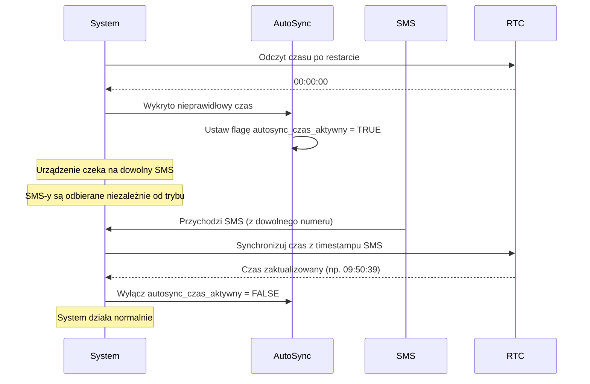
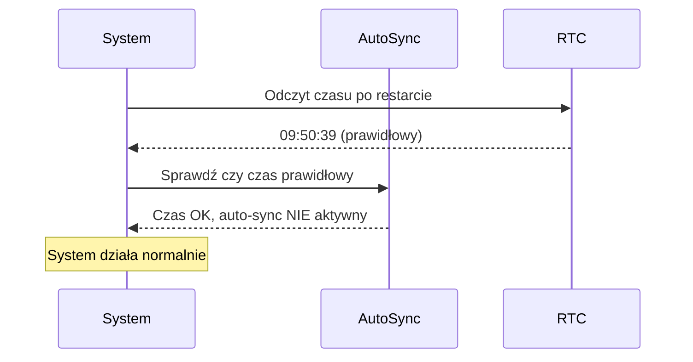

# Plan Implementacji: Automatyczna Synchronizacja Czasu Po Restarcie

## Cel

Dodanie mechanizmu automatycznej synchronizacji czasu, który:
1. Wykrywa nieprawidłowy czas (`00:00:xx`) po restarcie urządzenia
2. **Wysyła SMS do siebie** z treścią "Synchronizacja Czasu"
3. Odbiera ten SMS (z timestampem z sieci GSM)
4. Synchronizuje czas z timestampu SMS-a
5. Wyłącza mechanizm auto-sync po synchronizacji

## Kontekst

Po restarcie urządzenia (np. po zaniku zasilania), RTC w module SIM900 może zostać zresetowany do `00:00:00`. System potrzebuje mechanizmu automatycznej synchronizacji czasu, ponieważ:
- Harmonogram czasowy (`ABCD TIME`) wymaga poprawnego czasu
- Bez poprawnego czasu, urządzenie może być zablokowane przez `blokada_sterowania_czasowa`

> [!IMPORTANT]
> **Numer własny przez komendę MYNUM**
> 
> Użytkownik ustawia swój numer telefonu przez komendę: `ABCD MYNUM 123456789`
> Numer jest zapisywany w EEPROM i używany do wysyłania SMS-a do siebie.

## Proponowane Zmiany

### 1. Nowy Adres EEPROM

W pliku [`adresyeeprom.h`](file:///Users/gramsz/Desktop/AC-800-DTM-HARMO/uc/adresyeeprom.h):

```c
// Numer własny urządzenia (dla auto-sync czasu)
#define ADRES_EEPROM_MOJE_NUMER_START 0x0FF0  // 10 bajtów na numer (max 9 cyfr + null)
```

### 2. Nowe Zmienne Globalne

W pliku [`main.c`](file:///Users/gramsz/Desktop/AC-800-DTM-HARMO/uc/main.c):

```c
// Auto-sync czasu po restarcie
uchar autosync_czas_aktywny = FALSE;  // TRUE gdy oczekujemy na SMS do synchronizacji
uchar moj_numer_telefonu[MAX_LICZBA_ZNAKOW_TELEFON + 1];  // Numer własny urządzenia
```

### 3. Nowa Komenda SMS: MYNUM

W pliku [`interpretacjaSMS.c`](file:///Users/gramsz/Desktop/AC-800-DTM-HARMO/uc/interpretacjaSMS.c):

Dodać obsługę komendy `ABCD MYNUM 123456789`:
- Walidacja numeru (3-9 cyfr)
- Zapis do EEPROM pod adresem `ADRES_EEPROM_MOJE_NUMER_START`
- Odpowiedź SMS: "Numer zapisany: 123456789"

### Modyfikacja `wykonanie_polecenia_sms()`

W pliku [`main.c`](file:///Users/gramsz/Desktop/AC-800-DTM-HARMO/uc/main.c), linie 378-675:

**Po synchronizacji czasu (po linii 419), dodać:**

```c
// Auto-sync: Wyłącz po pierwszej synchronizacji
if (autosync_czas_aktywny) {
  autosync_czas_aktywny = FALSE;
}
```

---

## Przepływ Działania

### Scenariusz 1: Restart z Nieprawidłowym Czasem



### Scenariusz 2: Restart z Prawidłowym Czasem



---

## Plan Weryfikacji

### Testy Automatyczne

1. **Test wykrywania nieprawidłowego czasu:**
   - Ustaw `rtc_czas` na `"00:00:00"`
   - Wywołaj `inicjalizuj_parametry_modulu()`
   - Sprawdź czy `autosync_czas_aktywny == TRUE`
   - Sprawdź czy `tryb_pracy == 1` (Publiczny)

2. **Test synchronizacji:**
   - Aktywuj auto-sync
   - Symuluj odbiór SMS-a z timestampem
   - Sprawdź czy czas został zaktualizowany
   - Sprawdź czy `autosync_czas_aktywny == FALSE`
   - Sprawdź czy tryb pracy został przywrócony

### Testy Manualne

1. **Test na urządzeniu:**
   - Zresetuj urządzenie (odłącz zasilanie)
   - Sprawdź czy LED wskazuje tryb publiczny
   - Wyślij SMS z dowolnego numeru
   - Sprawdź czy urządzenie odebrało SMS
   - Sprawdź czy czas został zsynchronizowany (wyślij `ABCD SET` bez parametrów)
   - Sprawdź czy tryb pracy został przywrócony

---

## Bezpieczeństwo i Ograniczenia

> [!IMPORTANT]
> **Tymczasowy Tryb Publiczny**
> 
> Podczas auto-sync, urządzenie jest tymczasowo w trybie publicznym. Oznacza to, że:
> - Dowolny numer może otworzyć bramę przez krótki czas (do pierwszego SMS-a)
> - Czas trwania zależy od tego, jak szybko przyjdzie pierwszy SMS
> - W praktyce: kilka sekund do kilku minut

> [!NOTE]
> **Dlaczego nie wysyłamy SMS-a do siebie?**
> 
> Timestamp SMS-a pochodzi z sieci GSM i jest dostępny tylko przy **odbiorze** SMS-a, nie przy wysyłaniu. Dlatego nie możemy wysłać SMS-a do siebie - musimy czekać na przychodzący SMS.

### Alternatywne Rozwiązania (Nie Implementowane)

1. **Wysłanie SMS-a do Super Usera:** Wymaga znajomości numeru Super Usera
2. **Użycie NITZ (Network Time):** Wyłączone w poprzednich wersjach ze względu na konflikty
3. **Zapytanie RTC przez AT+CCLK:** Wymaga dodatkowej logiki i może zwrócić nieprawidłowy czas

---

## Pliki Do Modyfikacji

### [`main.c`](file:///Users/gramsz/Desktop/AC-800-DTM-HARMO/uc/main.c)

**Sekcja 1: Zmienne globalne (po linii 111)**
- Dodać: `autosync_czas_aktywny`, `autosync_poprzedni_tryb_pracy`

**Sekcja 2: `wykonanie_polecenia_sms()` (po linii 419)**
- Dodać: Logikę wyłączania auto-sync i przywracania trybu

**Sekcja 3: `inicjalizuj_parametry_modulu()` (przed linią 1824)**
- Dodać: Wykrywanie nieprawidłowego czasu i aktywację auto-sync

---

## Harmonogram Implementacji

1. ✅ Analiza kodu i stworzenie planu
2. ⏳ Dodanie zmiennych globalnych
3. ⏳ Modyfikacja `inicjalizuj_parametry_modulu()`
4. ⏳ Modyfikacja `wykonanie_polecenia_sms()`
5. ⏳ Kompilacja i weryfikacja
6. ⏳ Dokumentacja w języku polskim
7. ⏳ Testy na urządzeniu
